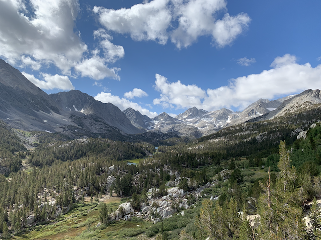

***

<div class = "row">
<div class = "col-md-6">
<br><br>**The Odyssey** is a GGE-sponsored trip aimed at introducing new students to the program and welcome them into the Ecology graduate community. Or some words that briefly summarize the mission...
</div>

<div class = "col-md-6">
<br><br>Some history, maybe. For over thirty years, GGE students, administrators and faculty have come together to organize an annual trip around California. Some more history that emphasizes the legacy.
</div>
</div>


```{r setup, include = F}
library(easypackages) # This has 
library(cowplot)
```


```{r, echo = F, results = "asis", fig.width= 10, fig.height=2.5}

p1 <- magick::image_read('img/2019_sierra2c.png') 
p2 <- magick::image_read('/Users/lizawood/Box/Odyssey/2019_grp_snarlc.png')
p3 <- magick::image_read('/Users/lizawood/Box/Odyssey/2019_cone.JPG')

p1p <- ggplot2::ggplot(iris)+
 ggpubr::background_image(p1)
p2p <- ggplot2::ggplot(iris)+
 ggpubr::background_image(p2)
p3p <- ggplot2::ggplot(iris)+
 ggpubr::background_image(p3)

plot_grid(p1p, p2p, p3p, ncol=3, nrow = 1)
```

```{r, include = F, eval = F}

#TEST


* 
* 

<script>
    md_gallery('class_name':'gallery-cols-3');
</script>
```

